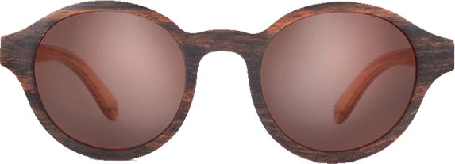

<!DOCTYPE html>
<html>
<head>
	<meta charset="UTF-8">
	<title>Home 3</title>
	<meta name="" content="content">
	<link rel="stylesheet" type="text/css" href="css/bootstrap.min.css">
	<link rel="stylesheet" type="text/css" href="css/home-3.css">
	
</head>
<body>
	

		<header class="a-1">
			 

			 	

			 		

			 			<form class="navbar-form pull-left">
							<input type="text" style="width: 200px;" placeholder="Từ khóa cần tìm ...">
							<input type="submit" class="btn btn-default" placeholder="search">
						</form>
						

							<a href="#" class="navbar-link">Links</a>
							<a href="#" class="navbar-link">Links</a>
							<a href="#" class="navbar-link">Links</a>
						

			 		

			 	

			 

		</header>
		<section class="logo">
			

				
					

						

					

			

		</section>

		<section class="menu">
			

				<nav class="navbar navbar-default menu-main" role="navigation">
<!-- 					

 -->						<!-- Brand and toggle get grouped for better mobile display -->
						

							<button type="button" class="navbar-toggle" data-toggle="collapse" data-target=".navbar-ex1-collapse">
								Toggle navigation
								
								
								
							</button>
						

				
						<!-- Collect the nav links, forms, and other content for toggling -->
						

								<ul class="nav navbar-nav navbar-right">
									<li><a href="#">Giới thiệu</a></li>
									<li><a href="#">NAM</a></li>
									<li><a href="#">NỮ</a></li>
									<li><a href="#">PHỤ KIỆN</a></li>
									<li><a href="#">Sự kiện – Khuyến mãi</a></li>
									<li><a href="#">Liên hệ</a></li>
									<li><a href="#">Tuyển Dụng</a></li>
								
								</ul>
						
<!-- /.navbar-collapse -->
					<!-- 
 -->
				</nav>
			

		</section>

		<section class="container">
			

				

					

						
Cam kết hàng chính hãng

					

				

				

					

						
Cam kết hàng chính hãng

					

				

				

					

						
Cam kết hàng chính hãng

					

				

			

			
		</section>

		

			<ol class="carousel-indicators">
				<li data-target="#carousel-id" data-slide-to="0" class=""></li>
				<li data-target="#carousel-id" data-slide-to="1" class="active"></li>
			</ol>
			

				

					
					
				

				

					
				

			

			<a class="left carousel-control" href="#carousel-id" data-slide="prev"></a>
			<a class="right carousel-control" href="#carousel-id" data-slide="next"></a>
		

		

			

				<h1 >WELCOME</h1>
				
			

			

				<nav class="navbar navbar-default menu-main" role="navigation">
										<!-- Brand and toggle get grouped for better mobile display -->
							

								<button type="button" class="navbar-toggle" data-toggle="collapse" data-target=".navbar-ex1-collapse">
									Toggle navigation
									
									
									
								</button>
							

					
							<!-- Collect the nav links, forms, and other content for toggling -->
							

									<ul class="nav navbar-nav">
										<li >
											<a href="#">Giới thiệu</a>
										</li>
										<li>
											<a href="#">Về Chúng Tôi</a>
										</li>
										<li>
											<a href="#">Liên Hệ</a>
										</li>
									</ul>
							
<!-- /.navbar-collapse -->
						<!-- 
 -->
					</nav>
				
Fashion is a full-service fashion and modeling school created by   supermodel Helen Tompson. Our mission is to give aspiring talent what it takes to achieve success in   the thrilling, but difficult industry. We offer comprehensive training and knowledge necessary to pursue  
				a variety of careers in the fashion field. Our students learn the best practices, taught by qualified professionals.

			

		

		

			
			

				<main class="a-3">

					

						<h2>
						Sản Phẩm nổi bật 
						</h2>
					

					

							

								
								

									<h4>BODHI - REDWOOD</h4>
									

										150$
									

									

										<a href="#" class="btn btn-info">Xem chi tiết</a>

									

								

							

					

					

							

								
								

									<h4>BODHI - REDWOOD</h4>
									

										150$
									

									

										<a href="#" class="btn btn-info">Xem chi tiết</a>

									

								

							

					

					

							

								
								

									<h4>BODHI - REDWOOD</h4>
									

										150$
									

									

										<a href="#" class="btn btn-info">Xem chi tiết</a>

									

								

							

					

					
				</main>

			

			
			

				<main class="a-3">

					

						<h2>
							Sản Phẩm mới về
						</h2>
					

					

							

								
								

									<h4>BODHI - REDWOOD</h4>
									

										150$
									

									

										<a href="#" class="btn btn-info">Xem chi tiết</a>

									

								

							

					

					

							

								
								

									<h4>BODHI - REDWOOD</h4>
									

										150$
									

									

										<a href="#" class="btn btn-info">Xem chi tiết</a>

									

								

							

					

					

							

								
								

									<h4>BODHI - REDWOOD</h4>
									

										150$
									

									

										<a href="#" class="btn btn-info">Xem chi tiết</a>

									

								

							

					

					
					
				</main>

			

		

		

	

	
	
	
</body>
</html>
